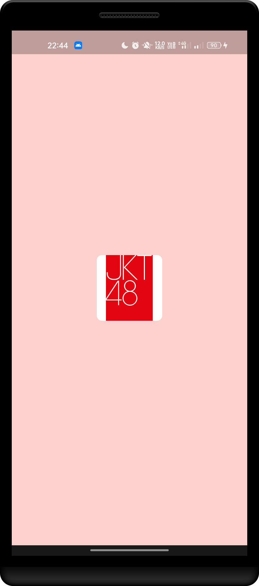
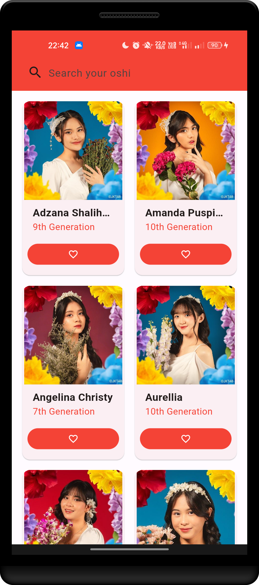
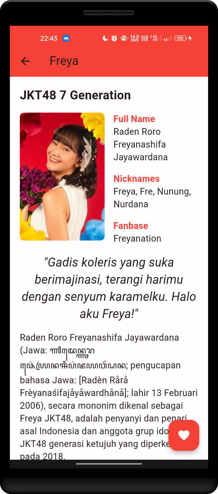

# Oshi Kita

**Oshi Kita** is a tribute Multiplatform application dedicated to [JKT48](https://jkt48.com). This is a flutter version to the [original version](https://github.com/fauzan-radji/oshi-kita) and [jetpack compose version](https://github.com/fauzan-radji/oshi-kita-compose).

## Preview

### Android

Here are some screenshots of the app.

  
  
  

### Web

See the [web version](https://fauzan-radji.github.io/oshi-kita-flutter) of the app.

## Features

- [x] Show list of members
- [x] Show detail of member
- [x] Search member by name, nicknames, jikoshokai, and description
- [ ] Add member to favorite

## Supported Language

- :indonesia: Indonesian
